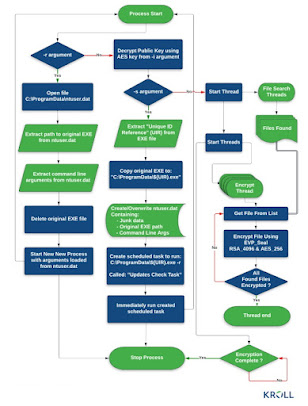
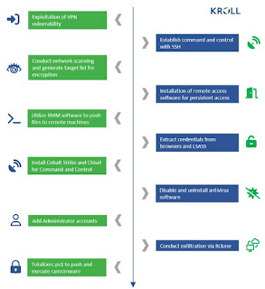

# Cactus Ransomware Overview

Cactus ransomware employs a combination of AES and RSA algorithms to encrypt business users' data, subsequently demanding a substantial ransom to restore access to the files. This ransomware, noted in a ransom note titled `cAcTuS.readme.txt`, was active in the second half of March 2023. It primarily targets English-speaking users and has the potential to spread worldwide.

## Directories for IOC and Notes

For more detailed information, please refer to the following directories:

- **IOCs**: Contains all the Indicators of Compromise related to Cactus ransomware. [IOC Directory](IOCs)
- **Notes**: Contains ransom notes and other related documents left by the ransomware group. [Notes Directory](Notes)

## File Extension Changes

When preparing a file for encryption, Cactus changes the file extension to `.CTS0`. After encryption, the extension becomes `.CTS1`. Cactus also has a "quick mode" for encryption. Running the malware in quick and normal modes consecutively results in double encryption of the same file, appending a new extension after each operation (e.g., `.CTS1` - `.CTS7`).

## Spread Mechanisms

Cactus ransomware can spread through unprotected RDP configurations, email spam, malicious attachments, deceptive downloads, botnets, exploits, malvertising, web injections, fake updates, repackaged and infected installers.

## Attack and Encryption Details

Cactus exploits known vulnerabilities in Fortinet VPN devices to gain initial access to the networks of large commercial enterprises. In all investigated incidents, hackers logged in from a VPN server using a VPN service account. The use of encryption to protect the ransomware binary file sets Cactus apart from other ransomware. A batch script was used to obtain the encryptor binary via 7-Zip. The original ZIP archive is deleted, and the binary is distributed with a special flag to enable execution. Researchers believe this process is designed to prevent the ransomware from being detected.

According to researchers at Kroll, there are three main execution modes selected using specific command line options: configuration (`-s`), reading configuration (`-r`), and encryption (`-i`). The `-s` and `-r` arguments allow attackers to configure persistence and store data in the `C:\ProgramData\ntuser.dat` file, which the ransomware reads when run with the `-r` command line argument. For file encryption, attackers must provide a unique AES key using the `-i` command line argument. This key is required to decrypt the ransomware configuration file, and the RSA public key is needed to encrypt the files. The encryptor binary contains a hard-coded hexadecimal string. Decoding this HEX string provides a piece of encrypted data unlocked using the AES key.

By essentially encrypting itself, Cactus makes detection difficult and helps evade antivirus and network monitoring tools. Running the binary with the correct key for the `-i` (encryption) option unlocks the information, allowing the malware to search for files and initiate a multi-threaded encryption process.

## Use of Legitimate Tools

After gaining access to the network, the attacker uses a scheduled task to establish persistent access via an SSH backdoor accessible from a command and control (C2) server. SoftPerfect Network Scanner (netscan) is used to search for interesting targets on the network. Attackers identify user accounts by enumerating endpoints, viewing successful logins in the Windows Event Viewer, and pinging remote hosts using PowerShell commands. Cactus uses a modified version of the open-source PSnmap tool, the PowerShell equivalent of the nmap network scanner. Various remote access methods are attempted using legitimate tools such as Splashtop, AnyDesk, SuperOps RMM, Cobalt Strike, and the Go-based proxy tool Chisel. After elevating privileges on a machine, Cactus operators run a batch script to uninstall commonly used antivirus products.

## Data Theft

Cactus also steals victims' data. To transfer files directly to cloud storage, the attacker uses the Rclone tool. After stealing the data, the hackers often use a PowerShell script named TotalExec, commonly found in BlackBasta Ransomware attacks, to automate the deployment of the encryption process.

## Encrypted File Types

The types of files encrypted include MS Office documents, OpenOffice files, PDFs, text files, databases, photos, music, videos, image files, archives, etc. Files associated with this ransomware include:

- Ransom note: `cAcTuS.readme.txt`
- Malicious scripts: `TotalExec.ps1`, `psnb.ps1`, `f1.bat`, `f2.bat`
- Approximate names of malicious files: `a12b-e4fg-c12g-zkc2.exe`, `abc1-d2ef-gh3i-4jkl.exe`
- Malicious file: `conhost.exe`

### Locations:

- `\Desktop\`
- `\User_folders\`
- `%TEMP%\`

### Registry Entries and Mutexes:

Refer to the analysis results below for details.

### Network Connections and Links:

- Email: `cactus@mexicomail.com`

## File Encryption Process

## Binary Code Execution

