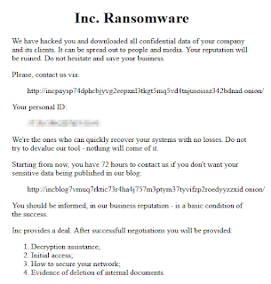
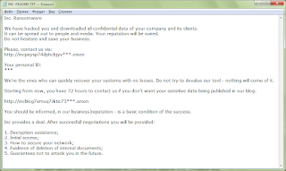

# INC Ransomware Overview

INC ransomware's activity was detected in early August 2023, but it appears to have begun a month earlier on June 12, 2023. It targets English-speaking users and has the potential to spread worldwide.

## Directories for IOC and Notes

For more detailed information, please refer to the following directories:

- **IOCs**: Contains all the Indicators of Compromise related to INC ransomware. [IOC Directory](IOCs)
- **Notes**: Contains ransom notes and other related documents left by the ransomware group. [Notes Directory](Notes)

## Examples of Ransom Notes

## Examples of File Extensions

- .INC  .
- INC-README.TXT 
- INC-README.HTML 

## Indicators

- **Ransomware Executable File Name**: Named for the impacted organization
- **Ransomware Executable SHA256 Hash**: `accd8bc0d0c2675c15c169688b882ded17e78aed0d914793098337afc57c289c`
- **Ransomware Executable PDB String**: `C:\source\INC Encryptor\Release\INC Encryptor.pdb`
- **Ransom Note File Name**: `*.inc-readme.txt`, `*.inc-readme.html`
- **Encrypted File Extension**: `*.inc`
- **Use of Compromised Valid Accounts**
- **Use of Native Tools**: `net.exe`, `nltest.exe`, `Wordpad/Notepad/MSPaint`, `Internet Explorer`, `Windows Explorer`, `mstsc.exe`, `msdt.exe`
- **Use of Additional Tools**: `7-Zip`, `MEGASync`, `Advanced IP Scanner`, `Putty`, `lsassy.py`, `PSExec`

## MITRE ATT&CK Techniques

- **Initial Access**: Valid Accounts/T1078.002
- **Execution**: Command and Scripting Interpreter/T1059.001, T1059.003; Windows Management Instrumentation/T1047
- **Persistence**: Valid Accounts/T1078.002
- **Privilege Escalation**: Valid Accounts/T1078.002
- **Defense Evasion**: Not Observed
- **Credential Access**: OS Credential Dumping/T1003.001
- **Discovery**: Domain Trust Discovery/T1482
- **Lateral Movement**: Remote Services/T1021.001, T1021.002
- **Collection**: Archive Collected Data/T1560.001
- **Command and Control**: Not Observed
- **Exfiltration**: Exfiltration Over Web Service/T1567.002
- **Impact**: Data Encrypted For Impact/T186

## Spread Mechanisms

INC ransomware can spread through hacking insecure RDP configurations, compromised valid accounts, email spam and malicious attachments, deceptive downloads, botnets, exploits, malvertising, web injections, fake updates, repackaged, and infected installers.

➤ **Uses Windows arsenal tools**: `net.exe`, `nltest.exe`, `Wordpad`, `Notepad`, `MSPaint`, `Internet Explorer`, `Windows Explorer`, `mstsc.exe`, `msdt.exe`

➤ **Uses additional tools**: `7-Zip`, `MEGASync`, `Advanced IP Scanner`, `Putty`, `lsassy.py`, `PSExec`

`PSExec` is used to run the executable encryption file. Before starting, it is renamed to `winupd` when running on a remote host.

