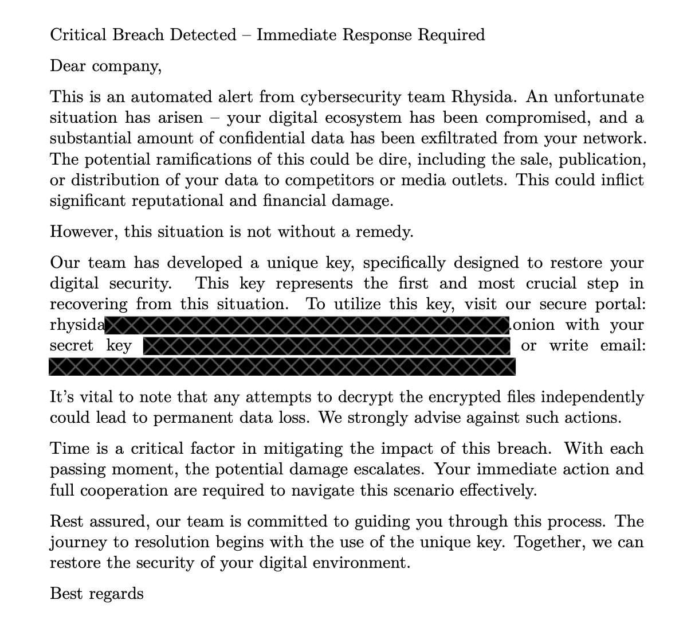
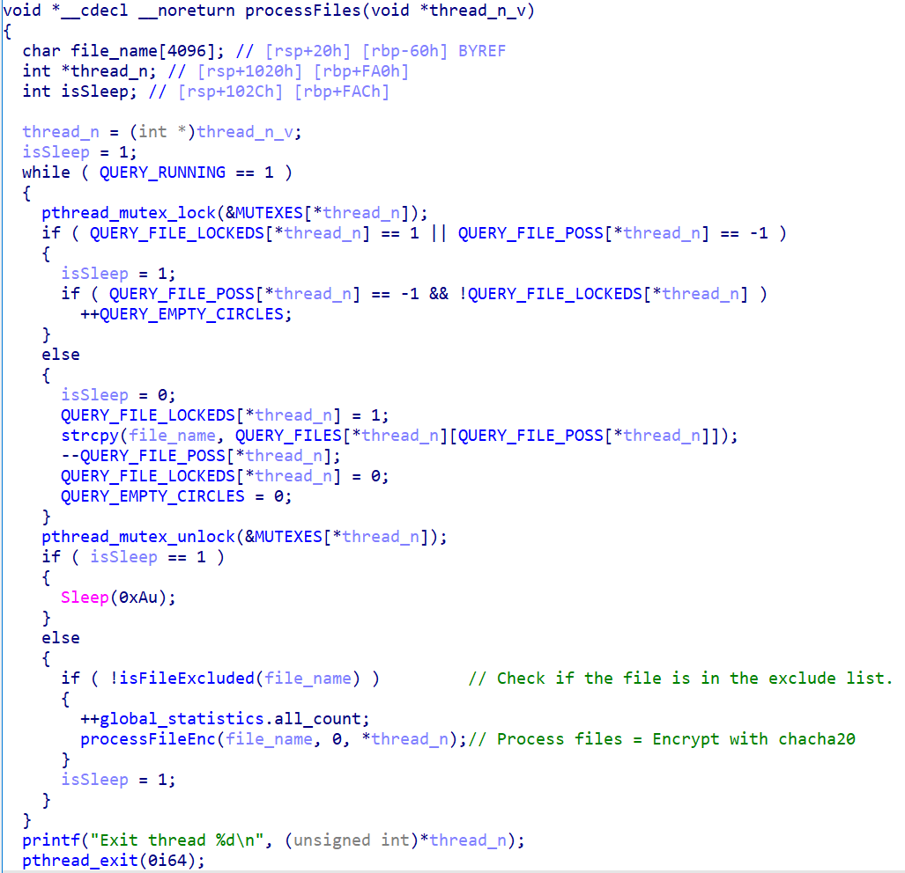

# Rhysida Ransomware Overview

As is often seen in the ransomware arena, this threat is delivered through various mechanisms, including phishing and being dropped as secondary payloads from command and control (C2) frameworks like Cobalt Strike. These frameworks are typically delivered as part of traditional commodity malware, so infection chains can vary widely.

The group itself likes to masquerade as a cybersecurity organization, as shown in the ransom note below. They claim to have compromised the company and are willing to help resolve the issue. Such approaches are not unusual — historically, groups have done things like providing "security reports" to compromised organizations to "help them solve the problem."

## Directories for IOC and Notes

For more detailed information, please refer to the following directories:

- **IOCs**: Contains all the Indicators of Compromise related to Rhysida ransomware. [IOC Directory](IOCs)
- **Notes**: Contains ransom notes and other related documents left by the ransomware group. [Notes Directory](Notes)

## Tactics, Techniques, and Procedures (TTPs)

### MITRE ATT&CK Matrix

- **Initial Access**: T1566 Phishing
  - Based on external reports, Rhysida uses phishing lures for initial access.
- **Execution**: 
  - T1059.003 Command and Scripting Interpreter: Windows Command Shell
    - It uses cmd.exe to execute commands for execution.
  - T1059.001 Command and Scripting Interpreter: PowerShell
    - It uses PowerShell to create a scheduled task named Rhsd pointing to the ransomware.
- **Persistence**: T1053.005 Scheduled Task/Job: Scheduled Task
  - When executed with the argument -S, it will create a scheduled task named Rhsd that will execute the ransomware.
- **Defense Evasion**:
  - T1070.004 Indicator Removal: File Deletion
    - Rhysida ransomware deletes itself after execution. The scheduled task (Rhsd) created would also be deleted after execution.
  - T1070.001 Indicator Removal: Clear Windows Event Logs
    - It uses wevtutil.exe to clear Windows event logs.
- **Discovery**:
  - T1083 File and Directory Discovery
    - It enumerates and looks for files to encrypt in all local drives.
  - T1082 System Information Discovery
    - Obtains the following information:
      - Number of processors
      - System information
- **Impact**:
  - T1490 Inhibit System Recovery
    - It uses vssadmin to remove volume shadow copies.
  - T1486 Data Encrypted for Impact
    - It uses a 4096-bit RSA key and Cha-cha20 for file encryption.
    - It avoids encrypting files with the following strings in their file name:
      - .bat
      - .bin
      - .cab
      - .cmd
      - .com
      - .cur
      - .diagcab
      - .diagcfg
      - .diagpkg
      - .drv
      - .dll
      - .exe
      - .hlp
      - .hta
      - .ico
      - .msi
      - .ocx
      - .ps1
      - .psm1
      - .scr
      - .sys
      - .ini
      - Thumbs.db
      - .url
      - .iso
    - It avoids encrypting files found in the following folders:
      - $Recycle.Bin
      - Boot
      - Documents and Settings
      - PerfLogs
      - ProgramData
      - Recovery
      - System Volume Information
      - Windows
      - $RECYCLE.BIN
      - ApzData
    - It appends the following extension to the file name of the encrypted files:
      - .rhysida
    - It encrypts all system drives from A to Z.
    - It drops the following ransom note:
      - {Encrypted Directory}\CriticalBreachDetected.pdf
  - T1491.001 Defacement: Internal Defacement
    - It changes the desktop wallpaper after encryption and prevents the user from changing it back by modifying the NoChangingWallpaper registry value.

## Encryption Process

Rhysida's encryption algorithm is relatively simple, using the ChaCha20 encryption algorithm. This algorithm has been seen before by other groups, either as a standalone encryption algorithm or as part of a more specialized approach. Rhysida will enumerate directories and files in the directories from drive "A:" to drive "Z:", ensuring they are not on the "exclusion list" before "processing," meaning encrypting, the files. After encryption, the file is renamed to "<filename>.rhysida".

### Excluded Extensions:

- .bat
- .bin
- .cab
- .cmd
- .com
- .cur
- .diagcab
- .diagcfg
- .diagpkg
- .drv
- .dll
- .exe
- .hlp
- .hta
- .ico
- .lnk
- .msi
- .ocx
- .ps1
- .psm1
- .scr
- .sys
- .ini
- Thumbs.db
- .url
- .iso
- .cab

After encryption, the ransomware displays the ransom note by creating and opening a PDF file and displaying the background wallpaper. The PDF, typically named “CriticalBreachDetected.pdf”, is created using content embedded in the ransomware binary file, including a skeleton PDF and ransom note. The ransom note is also typically used to create a message in the form of a background wallpaper located at “C:/Users/Public/bg.jpg”.
